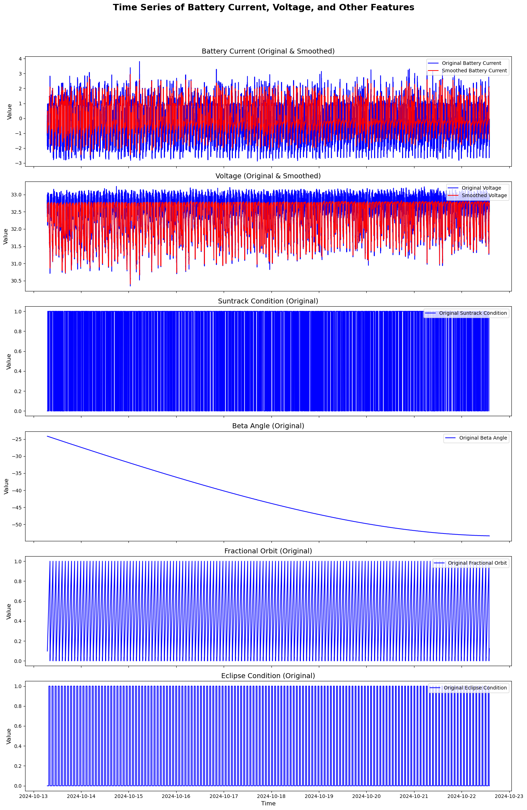
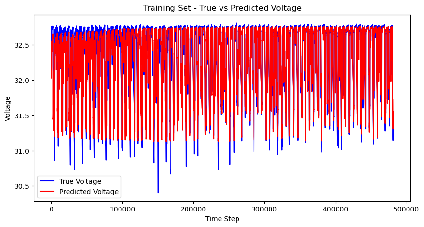
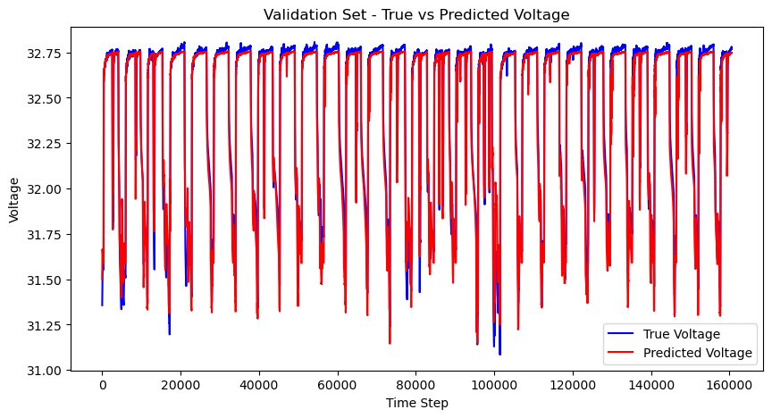

```python
from pathlib import Path
import sys
sys.path.append(str(Path.cwd().parent))
from dynamic_timeseries_dashboard_new import get_telemetry_data, ElasticsearchCloudQuery
import os
os.environ['TF_CPP_MIN_LOG_LEVEL'] = '3'  # Suppresses INFO (1), WARNING (2), and ERROR (3)
import tensorflow as tf
tf.get_logger().setLevel('ERROR')

```

    /home/ybondo/anaconda3/envs/jupytersb/lib/python3.11/site-packages/numpy/core/getlimits.py:542: UserWarning: Signature b'\x00\xd0\xcc\xcc\xcc\xcc\xcc\xcc\xfb\xbf\x00\x00\x00\x00\x00\x00' for <class 'numpy.longdouble'> does not match any known type: falling back to type probe function.
    This warnings indicates broken support for the dtype!
      machar = _get_machar(dtype)


```python
import numpy as np
import pandas as pd
import pendulum

# Pull telemetry data (same as before)
telemetry_puller = ElasticsearchCloudQuery(context='telemetry', environment='prod', debug=False)
spacecraft_id = '105'
start_time = pendulum.parse('2024-10-13T07:00:00Z')
end_time = pendulum.parse('2024-10-22T14:00:00Z')
# start_time = pendulum.parse('2024-10-19T07:00:00Z')
# end_time = pendulum.parse('2024-10-19T14:00:00Z')


# Define telemetry points to pull
telemetry_points = [
    'spacecraft_eps_pcu_batteryVoltage',
    'spacecraft_eps_pcu_loadCurrent',
    'spacecraft_eps_pcu_solarArrayCurrent',
    'spacecraft_adcs_afswOut_acMode',
    'spacecraft_adcs_afswOut_eclipseCondition',
    'spacecraft_adcs_afswOut_betaAngle',
    # 'spacecraft_eps_pcu_batteryATemp1',
    # 'spacecraft_eps_pcu_batteryATemp2',
    # 'spacecraft_eps_pcu_batteryATemp3',
    # 'spacecraft_eps_pcu_batteryBTemp1',
    # 'spacecraft_eps_pcu_batteryBTemp2',
    # 'spacecraft_eps_pcu_batteryBTemp3'
]

# Fetch data from Elasticsearch
df_ = get_telemetry_data(
    telemetry_puller=telemetry_puller, 
    spacecraft_id=spacecraft_id, 
    start=start_time, 
    end=end_time, 
    telemetry_points=telemetry_points, 
    debug=True
)

print(df_.head(0))
```

    Using cached telemetry data
    Empty DataFrame
    Columns: [spacecraft_eps_pcu_batteryVoltage, spacecraft_eps_pcu_loadCurrent, spacecraft_eps_pcu_solarArrayCurrent, spacecraft_adcs_afswOut_acMode, spacecraft_adcs_afswOut_eclipseCondition, spacecraft_adcs_afswOut_betaAngle]
    Index: []


```python
import numpy as np
import pandas as pd
import matplotlib.pyplot as plt
from scipy.signal import savgol_filter

# Define default orbit period (90 minutes = 5400 seconds)
orbit_period = 5400  # in seconds

# 1. Calculate Battery Current (loadCurrent - solarArrayCurrent)
df_['battery_current'] = df_['spacecraft_eps_pcu_loadCurrent'] - df_['spacecraft_eps_pcu_solarArrayCurrent']

# 2. Simplify Temperature (Retain only extreme trends)
# temperature_columns = [
#     'spacecraft_eps_pcu_batteryATemp1', 'spacecraft_eps_pcu_batteryATemp2', 'spacecraft_eps_pcu_batteryATemp3',
#     'spacecraft_eps_pcu_batteryBTemp1', 'spacecraft_eps_pcu_batteryBTemp2', 'spacecraft_eps_pcu_batteryBTemp3'
# ]

# Calculate the midpoint temperature for each row
# df_['temp_midpoint'] = df_[temperature_columns].mean(axis=1)

# For each row, retain the highest temperature if it's above the midpoint, and the lowest if it's below
# df_['temperature'] = np.where(df_[temperature_columns].max(axis=1) > df_['temp_midpoint'],
#                               df_[temperature_columns].max(axis=1),
#                               df_[temperature_columns].min(axis=1))

# 3. Create Suntrack Condition (acMode == 5 => suntracking)
df_['suntrack_condition'] = np.where(df_['spacecraft_adcs_afswOut_acMode'] == 5, 1, 0)

# 4. Retain Eclipse Condition (already in telemetry)
df_['eclipse_condition'] = df_['spacecraft_adcs_afswOut_eclipseCondition']

# 5. Calculate Fractional Orbit
# Prepare eclipse exit times and add 'fractional_orbit' column
df_['fractional_orbit'] = np.nan
eclipse_exits = df_[(df_['spacecraft_adcs_afswOut_eclipseCondition'] == 0) & 
                    (df_['spacecraft_adcs_afswOut_eclipseCondition'].shift(1) == 1)].index

# Precompute the next and last eclipse exits for each timestamp, ensuring they are within bounds
next_exit_idx = np.minimum(eclipse_exits.searchsorted(df_.index, side='right'), len(eclipse_exits) - 1)
last_exit_idx = np.maximum(0, next_exit_idx - 1)  # Ensure index doesn't go below zero

# Fetch next and last eclipse exits while handling cases where indices may be out of range
next_eclipse_exit = eclipse_exits[next_exit_idx].to_series(index=df_.index, name='next_exit')
last_eclipse_exit = eclipse_exits[last_exit_idx].to_series(index=df_.index, name='last_exit')

# Calculate time since and until eclipse exit in seconds using vectorized .dt.total_seconds()
time_since_last_exit = (df_.index.to_series() - last_eclipse_exit).dt.total_seconds()
time_until_next_exit = (next_eclipse_exit - df_.index.to_series()).dt.total_seconds()

# Use np.where to assign fractional orbit with vectorized conditions
df_['fractional_orbit'] = np.where(
    pd.notna(time_since_last_exit),
    (time_since_last_exit % orbit_period) / orbit_period,
    np.where(
        pd.notna(time_until_next_exit),
        1 - (time_until_next_exit % orbit_period) / orbit_period,
        0
    )
)

# Forward-fill NaN values in fractional_orbit to replace with last valid value
df_['fractional_orbit'] = df_['fractional_orbit'].ffill()

# Apply Savitzky-Golay filter to smooth only battery current and voltage
def smooth_feature(series, window_length=60, poly_order=1):
    if len(series) < window_length:
        window_length = len(series) - (1 - len(series) % 2)  # Ensure window length is odd and <= data length
    return savgol_filter(series, window_length=window_length, polyorder=poly_order)

# Smooth specific features
df_['smoothed_battery_current'] = smooth_feature(df_['battery_current'], window_length=120, poly_order=1)
df_['smoothed_voltage'] = smooth_feature(df_['spacecraft_eps_pcu_batteryVoltage'])

# Function to plot time series subplots
def plot_time_series_subplots(df, features, titles, title="Feature Time Series", zoom=False, start_time=None, end_time=None):
    # Select time index and features based on zoom range
    time_index = df.index
    if zoom and start_time is not None and end_time is not None:
        # Apply time range filter
        mask = (time_index >= start_time) & (time_index <= end_time)
        df = df[mask]
        time_index = df.index
    
    num_features = len(features)
    
    # Set up subplots
    fig, axes = plt.subplots(num_features, 1, figsize=(15, 4 * num_features), sharex=True)
    fig.suptitle(title, fontsize=18, fontweight='bold')

    for i, feature in enumerate(features):
        original_data = df[feature]
        # Plot original data
        axes[i].plot(time_index, original_data, label=f'Original {titles[i]}', linestyle='-', color='blue')
        
        # Plot smoothed data if feature matches
        if feature == 'battery_current':
            axes[i].plot(time_index, df['smoothed_battery_current'], label='Smoothed Battery Current', linestyle='-', color='red')
        elif feature == 'spacecraft_eps_pcu_batteryVoltage':
            axes[i].plot(time_index, df['smoothed_voltage'], label='Smoothed Voltage', linestyle='-', color='red')
        
        # Customizations
        axes[i].set_title(f'{titles[i]} (Original{" & Smoothed" if feature in ["battery_current", "spacecraft_eps_pcu_batteryVoltage"] else ""})', fontsize=14)
        axes[i].legend(loc='upper right')
    
    # Set font size for x-axis and y-axis labels
    for ax in axes:
        ax.set_ylabel('Value', fontsize=12)
    axes[-1].set_xlabel('Time', fontsize=12)
    
    plt.tight_layout(rect=[0, 0.03, 1, 0.95])
    plt.show()

# Define features and their display titles
features = [
    'battery_current', 
    'spacecraft_eps_pcu_batteryVoltage', 
    'suntrack_condition', 
    'spacecraft_adcs_afswOut_betaAngle', 
    'fractional_orbit', 
    'eclipse_condition'
]
titles = [
    'Battery Current', 
    'Voltage', 
    'Suntrack Condition', 
    'Beta Angle', 
    'Fractional Orbit', 
    'Eclipse Condition'
]

# Uncomment to plot all main features
plot_time_series_subplots(df_, features, titles, title="Time Series of Battery Current, Voltage, and Other Features")

```


    

    


```python
# plot_time_series_subplots(df_, features, titles, title="Time Series of Battery Current, Voltage, and Other Features", zoom=True, start_time='2024-10-19T07:00:00Z' , end_time='2024-10-19T08:00:00Z' )
```


```python
import tensorflow as tf
from sklearn.preprocessing import StandardScaler

# Apply Savitzky-Golay filter to smooth 'battery_current' and 'voltage'
df_['Battery Current'] = smooth_feature(df_['spacecraft_eps_pcu_loadCurrent'] - df_['spacecraft_eps_pcu_solarArrayCurrent'])
df_['Battery Voltage'] = smooth_feature(df_['spacecraft_eps_pcu_batteryVoltage'])

# # Compute rate of change for Battery Current
# df_['current_rate_of_change'] = df_['Battery Current'].diff()

# # Fill any NaN values that might be introduced (e.g., the first row)
# df_['current_rate_of_change'] = df_['current_rate_of_change'].fillna(0)


# Rename other telemetry points for clarity
df_.rename(columns={
    'suntrack_condition': 'Suntrack Condition',
    'spacecraft_adcs_afswOut_betaAngle': 'Beta Angle',
    # 'temperature': 'Temperature',
    'eclipse_condition': 'Eclipse Condition',
    'fractional_orbit': 'Fractional Orbit'
}, inplace=True)

# Include the new feature in the scaling process
features_to_scale = ['Battery Current', 'Battery Voltage', 'Suntrack Condition', 
                     'Beta Angle', 'Eclipse Condition', 
                     'Fractional Orbit']

# Scale the features
scaler = StandardScaler()
scaled_features = scaler.fit_transform(df_[features_to_scale])

# Convert scaled data to DataFrame for consistency
scaled_df = pd.DataFrame(scaled_features, columns=features_to_scale, index=df_.index)

# Update the feature set (X)
X = scaled_df.drop(columns=['Battery Voltage']).to_numpy()  # Voltage remains as the label (y)
y = scaled_df['Battery Voltage'].to_numpy()

# Split data into training, validation, and test sets
num_data = len(X)
train_size = int(0.6 * num_data)
val_size = int(0.2 * num_data)

X_train, y_train = X[:train_size], y[:train_size]
X_val, y_val = X[train_size:train_size + val_size], y[train_size:train_size + val_size]
X_test, y_test = X[train_size + val_size:], y[train_size + val_size:]

# Define preprocessing function for TensorFlow model
def preprocess_data(X, y, window_size=1, batch_size=1032, shuffle_buffer=10000):
    dataset = tf.data.Dataset.from_tensor_slices((X, y))
    dataset = dataset.window(window_size + 1, shift=1, drop_remainder=True)
    dataset = dataset.flat_map(lambda x, y: tf.data.Dataset.zip((x.batch(window_size + 1), y.batch(window_size + 1))))
    dataset = dataset.map(lambda x, y: (x[:-1], y[-1]))
    dataset = dataset.shuffle(shuffle_buffer).batch(batch_size).repeat().prefetch(tf.data.AUTOTUNE)
    return dataset

# Create datasets
train_dataset = preprocess_data(X_train, y_train)
val_dataset = preprocess_data(X_val, y_val)
test_dataset = preprocess_data(X_test, y_test)

# Verify batch shapes
for x_batch, y_batch in train_dataset.take(1):
    print("X batch shape:", x_batch.shape)
    print("Y batch shape:", y_batch.shape)

```

    X batch shape: (1032, 1, 5)
    Y batch shape: (1032,)


```python
batch_size = 1032
desired_steps_train = X_train.shape[0]//batch_size
desired_steps_val = X_val.shape[0]//batch_size
warmup_epochs = 1  # typically 1-5 epochs is common
warmup_steps = desired_steps_train * warmup_epochs
print(desired_steps_train, f"\n{desired_steps_val}\n{warmup_steps}")
```

    466 
    155
    466


```python
class ResidualBlock(tf.keras.layers.Layer):
    def __init__(self, filters, kernel_size=3):
        super(ResidualBlock, self).__init__()
        self.filters = filters
        self.kernel_size = kernel_size
        self.batch_norm1 = tf.keras.layers.BatchNormalization()
        self.conv1 = tf.keras.layers.Conv1D(filters, kernel_size=kernel_size, padding='same', kernel_initializer='he_normal')
        self.batch_norm2 = tf.keras.layers.BatchNormalization()
        self.conv2 = tf.keras.layers.Conv1D(filters, kernel_size=kernel_size, padding='same', kernel_initializer='he_normal')
        self.adjust_channels = None

    def build(self, input_shape):
        if input_shape[-1] != self.filters:
            self.adjust_channels = tf.keras.layers.Conv1D(self.filters, kernel_size=1, padding='same', kernel_initializer='he_normal')
        super(ResidualBlock, self).build(input_shape)

    def call(self, x):
        residual = self.adjust_channels(x) if self.adjust_channels else x
        x = self.batch_norm1(x)
        x = tf.keras.activations.relu(x)
        x = self.conv1(x)
        x = self.batch_norm2(x)
        x = tf.keras.activations.relu(x)
        x = self.conv2(x)
        return tf.keras.layers.add([x, residual])

    def get_config(self):
        config = super().get_config()
        config.update({
            "filters": self.filters,
            "kernel_size": self.kernel_size,
        })
        return config


class ResidualDenseBlock(tf.keras.layers.Layer):
    def __init__(self, units, activation='relu', kernel_regularizer=None):
        super(ResidualDenseBlock, self).__init__()
        self.units = units
        self.activation = activation
        self.kernel_regularizer = kernel_regularizer
        
        # First dense layer
        self.dense1 = tf.keras.layers.Dense(units, activation=activation, kernel_regularizer=kernel_regularizer, 
                                            kernel_initializer='he_normal')
        # Second dense layer
        self.dense2 = tf.keras.layers.Dense(units, activation=None, kernel_regularizer=kernel_regularizer, 
                                            kernel_initializer='he_normal')
        
        # Layer normalization to ensure stable training
        self.layer_norm1 = tf.keras.layers.LayerNormalization()
        self.layer_norm2 = tf.keras.layers.LayerNormalization()
        
        # Define a linear layer to adjust input dimensions if necessary
        self.adjust_channels = None

    def build(self, input_shape):
        if input_shape[-1] != self.units:
            self.adjust_channels = tf.keras.layers.Dense(self.units, activation=None)
        super(ResidualDenseBlock, self).build(input_shape)

    def call(self, x):
        residual = self.adjust_channels(x) if self.adjust_channels else x
        
        # Pass through first dense layer and apply layer norm
        x = self.dense1(x)
        x = self.layer_norm1(x)
        x = tf.keras.activations.relu(x)
        
        # Pass through second dense layer and apply layer norm
        x = self.dense2(x)
        x = self.layer_norm2(x)
        
        # Add the residual connection (skip connection)
        return tf.keras.layers.add([x, residual])

    def get_config(self):
        config = super().get_config()
        config.update({
            "units": self.units,
            "activation": self.activation,
            "kernel_regularizer": self.kernel_regularizer,
        })
        return config


model = tf.keras.Sequential([
    # Input layer with fixed time steps based on your window_size
    tf.keras.layers.Input(shape=(1, 5)),  # Adjust the first dimension to match your window_size
    
    # Improved Residual CNN blocks
    ResidualBlock(filters=64, kernel_size=3),
    ResidualBlock(filters=64, kernel_size=3),
    
    tf.keras.layers.SpatialDropout1D(0.1),
    
    # Fixed LSTM layers without unroll
    tf.keras.layers.Bidirectional(tf.keras.layers.LSTM(128, 
        return_sequences=True,
        recurrent_initializer='orthogonal',
        recurrent_regularizer=tf.keras.regularizers.l2(1e-5),
        recurrent_dropout=0.1)),
    
    tf.keras.layers.Bidirectional(tf.keras.layers.LSTM(128,
        return_sequences=True,
        recurrent_initializer='orthogonal',
        recurrent_regularizer=tf.keras.regularizers.l2(1e-5),
        recurrent_dropout=0.1)),
    
    tf.keras.layers.Bidirectional(tf.keras.layers.LSTM(128,
        return_sequences=False,
        recurrent_initializer='orthogonal',
        recurrent_regularizer=tf.keras.regularizers.l2(1e-5),
        recurrent_dropout=0.1)),
    
    tf.keras.layers.LayerNormalization(),
    
    # Dense layers remain the same
    ResidualDenseBlock(units=256, activation='selu',
                      kernel_regularizer=tf.keras.regularizers.l2(0.0005)),
    tf.keras.layers.Dropout(0.2),
    
    ResidualDenseBlock(units=128, activation='selu',
                      kernel_regularizer=tf.keras.regularizers.l2(0.0005)),
    tf.keras.layers.Dropout(0.2),
    
    tf.keras.layers.Dense(64, activation='selu',
                         kernel_regularizer=tf.keras.regularizers.l2(0.0005),
                         kernel_initializer='lecun_normal'),
    tf.keras.layers.Dense(32, activation='selu',
                         kernel_regularizer=tf.keras.regularizers.l2(0.0005),
                         kernel_initializer='lecun_normal'),
    tf.keras.layers.Dropout(0.1),
    
    tf.keras.layers.Dense(1, activation='linear')
])

lr_schedule = tf.keras.optimizers.schedules.ExponentialDecay(
    initial_learning_rate=0.001,
    decay_steps=desired_steps_train,
    decay_rate=0.95,
    staircase=True
)


# Compile with improved settings
model.compile(
    optimizer=tf.keras.optimizers.Adam(
        learning_rate=lr_schedule,
        beta_1=0.9,
        beta_2=0.999,
        epsilon=1e-7,
        clipnorm=1.0  # Add gradient clipping
    ),
    loss=tf.keras.losses.Huber(delta=1.0),
    metrics=['mse', 'mae']
)

model.summary()

```


<pre style="white-space:pre;overflow-x:auto;line-height:normal;font-family:Menlo,'DejaVu Sans Mono',consolas,'Courier New',monospace"><span style="font-weight: bold">Model: "sequential"</span>
</pre>


<pre style="white-space:pre;overflow-x:auto;line-height:normal;font-family:Menlo,'DejaVu Sans Mono',consolas,'Courier New',monospace">┏━━━━━━━━━━━━━━━━━━━━━━━━━━━━━━━━━┳━━━━━━━━━━━━━━━━━━━━━━━━┳━━━━━━━━━━━━━━━┓
┃<span style="font-weight: bold"> Layer (type)                    </span>┃<span style="font-weight: bold"> Output Shape           </span>┃<span style="font-weight: bold">       Param # </span>┃
┡━━━━━━━━━━━━━━━━━━━━━━━━━━━━━━━━━╇━━━━━━━━━━━━━━━━━━━━━━━━╇━━━━━━━━━━━━━━━┩
│ residual_block (<span style="color: #0087ff; text-decoration-color: #0087ff">ResidualBlock</span>)  │ (<span style="color: #00d7ff; text-decoration-color: #00d7ff">None</span>, <span style="color: #00af00; text-decoration-color: #00af00">1</span>, <span style="color: #00af00; text-decoration-color: #00af00">64</span>)          │        <span style="color: #00af00; text-decoration-color: #00af00">14,036</span> │
├─────────────────────────────────┼────────────────────────┼───────────────┤
│ residual_block_1                │ (<span style="color: #00d7ff; text-decoration-color: #00d7ff">None</span>, <span style="color: #00af00; text-decoration-color: #00af00">1</span>, <span style="color: #00af00; text-decoration-color: #00af00">64</span>)          │        <span style="color: #00af00; text-decoration-color: #00af00">25,216</span> │
│ (<span style="color: #0087ff; text-decoration-color: #0087ff">ResidualBlock</span>)                 │                        │               │
├─────────────────────────────────┼────────────────────────┼───────────────┤
│ spatial_dropout1d               │ (<span style="color: #00d7ff; text-decoration-color: #00d7ff">None</span>, <span style="color: #00af00; text-decoration-color: #00af00">1</span>, <span style="color: #00af00; text-decoration-color: #00af00">64</span>)          │             <span style="color: #00af00; text-decoration-color: #00af00">0</span> │
│ (<span style="color: #0087ff; text-decoration-color: #0087ff">SpatialDropout1D</span>)              │                        │               │
├─────────────────────────────────┼────────────────────────┼───────────────┤
│ bidirectional (<span style="color: #0087ff; text-decoration-color: #0087ff">Bidirectional</span>)   │ (<span style="color: #00d7ff; text-decoration-color: #00d7ff">None</span>, <span style="color: #00af00; text-decoration-color: #00af00">1</span>, <span style="color: #00af00; text-decoration-color: #00af00">256</span>)         │       <span style="color: #00af00; text-decoration-color: #00af00">197,632</span> │
├─────────────────────────────────┼────────────────────────┼───────────────┤
│ bidirectional_1 (<span style="color: #0087ff; text-decoration-color: #0087ff">Bidirectional</span>) │ (<span style="color: #00d7ff; text-decoration-color: #00d7ff">None</span>, <span style="color: #00af00; text-decoration-color: #00af00">1</span>, <span style="color: #00af00; text-decoration-color: #00af00">256</span>)         │       <span style="color: #00af00; text-decoration-color: #00af00">394,240</span> │
├─────────────────────────────────┼────────────────────────┼───────────────┤
│ bidirectional_2 (<span style="color: #0087ff; text-decoration-color: #0087ff">Bidirectional</span>) │ (<span style="color: #00d7ff; text-decoration-color: #00d7ff">None</span>, <span style="color: #00af00; text-decoration-color: #00af00">256</span>)            │       <span style="color: #00af00; text-decoration-color: #00af00">394,240</span> │
├─────────────────────────────────┼────────────────────────┼───────────────┤
│ layer_normalization             │ (<span style="color: #00d7ff; text-decoration-color: #00d7ff">None</span>, <span style="color: #00af00; text-decoration-color: #00af00">256</span>)            │           <span style="color: #00af00; text-decoration-color: #00af00">512</span> │
│ (<span style="color: #0087ff; text-decoration-color: #0087ff">LayerNormalization</span>)            │                        │               │
├─────────────────────────────────┼────────────────────────┼───────────────┤
│ residual_dense_block            │ (<span style="color: #00d7ff; text-decoration-color: #00d7ff">None</span>, <span style="color: #00af00; text-decoration-color: #00af00">256</span>)            │       <span style="color: #00af00; text-decoration-color: #00af00">132,608</span> │
│ (<span style="color: #0087ff; text-decoration-color: #0087ff">ResidualDenseBlock</span>)            │                        │               │
├─────────────────────────────────┼────────────────────────┼───────────────┤
│ dropout (<span style="color: #0087ff; text-decoration-color: #0087ff">Dropout</span>)               │ (<span style="color: #00d7ff; text-decoration-color: #00d7ff">None</span>, <span style="color: #00af00; text-decoration-color: #00af00">256</span>)            │             <span style="color: #00af00; text-decoration-color: #00af00">0</span> │
├─────────────────────────────────┼────────────────────────┼───────────────┤
│ residual_dense_block_1          │ (<span style="color: #00d7ff; text-decoration-color: #00d7ff">None</span>, <span style="color: #00af00; text-decoration-color: #00af00">128</span>)            │        <span style="color: #00af00; text-decoration-color: #00af00">82,816</span> │
│ (<span style="color: #0087ff; text-decoration-color: #0087ff">ResidualDenseBlock</span>)            │                        │               │
├─────────────────────────────────┼────────────────────────┼───────────────┤
│ dropout_1 (<span style="color: #0087ff; text-decoration-color: #0087ff">Dropout</span>)             │ (<span style="color: #00d7ff; text-decoration-color: #00d7ff">None</span>, <span style="color: #00af00; text-decoration-color: #00af00">128</span>)            │             <span style="color: #00af00; text-decoration-color: #00af00">0</span> │
├─────────────────────────────────┼────────────────────────┼───────────────┤
│ dense_4 (<span style="color: #0087ff; text-decoration-color: #0087ff">Dense</span>)                 │ (<span style="color: #00d7ff; text-decoration-color: #00d7ff">None</span>, <span style="color: #00af00; text-decoration-color: #00af00">64</span>)             │         <span style="color: #00af00; text-decoration-color: #00af00">8,256</span> │
├─────────────────────────────────┼────────────────────────┼───────────────┤
│ dense_5 (<span style="color: #0087ff; text-decoration-color: #0087ff">Dense</span>)                 │ (<span style="color: #00d7ff; text-decoration-color: #00d7ff">None</span>, <span style="color: #00af00; text-decoration-color: #00af00">32</span>)             │         <span style="color: #00af00; text-decoration-color: #00af00">2,080</span> │
├─────────────────────────────────┼────────────────────────┼───────────────┤
│ dropout_2 (<span style="color: #0087ff; text-decoration-color: #0087ff">Dropout</span>)             │ (<span style="color: #00d7ff; text-decoration-color: #00d7ff">None</span>, <span style="color: #00af00; text-decoration-color: #00af00">32</span>)             │             <span style="color: #00af00; text-decoration-color: #00af00">0</span> │
├─────────────────────────────────┼────────────────────────┼───────────────┤
│ dense_6 (<span style="color: #0087ff; text-decoration-color: #0087ff">Dense</span>)                 │ (<span style="color: #00d7ff; text-decoration-color: #00d7ff">None</span>, <span style="color: #00af00; text-decoration-color: #00af00">1</span>)              │            <span style="color: #00af00; text-decoration-color: #00af00">33</span> │
└─────────────────────────────────┴────────────────────────┴───────────────┘
</pre>


<pre style="white-space:pre;overflow-x:auto;line-height:normal;font-family:Menlo,'DejaVu Sans Mono',consolas,'Courier New',monospace"><span style="font-weight: bold"> Total params: </span><span style="color: #00af00; text-decoration-color: #00af00">1,251,669</span> (4.77 MB)
</pre>


<pre style="white-space:pre;overflow-x:auto;line-height:normal;font-family:Menlo,'DejaVu Sans Mono',consolas,'Courier New',monospace"><span style="font-weight: bold"> Trainable params: </span><span style="color: #00af00; text-decoration-color: #00af00">1,251,275</span> (4.77 MB)
</pre>


<pre style="white-space:pre;overflow-x:auto;line-height:normal;font-family:Menlo,'DejaVu Sans Mono',consolas,'Courier New',monospace"><span style="font-weight: bold"> Non-trainable params: </span><span style="color: #00af00; text-decoration-color: #00af00">394</span> (1.54 KB)
</pre>


```python
callbacks = [
    tf.keras.callbacks.EarlyStopping(
        monitor='val_loss',
        patience=10,
        restore_best_weights=True,
        min_delta=1e-4,
        verbose=1
    )
]

history = model.fit(train_dataset, validation_data=val_dataset, steps_per_epoch=desired_steps_train, 
                    validation_steps=desired_steps_val, epochs=100, callbacks=callbacks)

```

    Epoch 1/100
    466/466 ━━━━━━━━━━━━━━━━━━━━ 106s 196ms/step - loss: 0.8544 - mae: 0.4938 - mse: 0.7618 - val_loss: 0.2813 - val_mae: 0.2277 - val_mse: 0.1254
    Epoch 2/100
    466/466 ━━━━━━━━━━━━━━━━━━━━ 120s 259ms/step - loss: 0.2024 - mae: 0.1826 - mse: 0.0618 - val_loss: 0.1176 - val_mae: 0.2087 - val_mse: 0.0730
    Epoch 3/100
    466/466 ━━━━━━━━━━━━━━━━━━━━ 121s 260ms/step - loss: 0.0924 - mae: 0.1587 - mse: 0.0489 - val_loss: 0.0835 - val_mae: 0.2001 - val_mse: 0.0865
    Epoch 4/100
    466/466 ━━━━━━━━━━━━━━━━━━━━ 131s 282ms/step - loss: 0.0566 - mae: 0.1454 - mse: 0.0422 - val_loss: 0.0561 - val_mae: 0.1497 - val_mse: 0.0631
    Epoch 5/100
    466/466 ━━━━━━━━━━━━━━━━━━━━ 130s 279ms/step - loss: 0.0423 - mae: 0.1402 - mse: 0.0396 - val_loss: 0.0557 - val_mae: 0.1799 - val_mse: 0.0765
    Epoch 6/100
    466/466 ━━━━━━━━━━━━━━━━━━━━ 119s 257ms/step - loss: 0.0354 - mae: 0.1365 - mse: 0.0376 - val_loss: 0.0729 - val_mae: 0.2074 - val_mse: 0.1179
    Epoch 7/100
    466/466 ━━━━━━━━━━━━━━━━━━━━ 124s 268ms/step - loss: 0.0314 - mae: 0.1318 - mse: 0.0357 - val_loss: 0.0715 - val_mae: 0.2117 - val_mse: 0.1198
    Epoch 8/100
    466/466 ━━━━━━━━━━━━━━━━━━━━ 107s 231ms/step - loss: 0.0290 - mae: 0.1275 - mse: 0.0346 - val_loss: 0.0466 - val_mae: 0.1945 - val_mse: 0.0734
    Epoch 9/100
    466/466 ━━━━━━━━━━━━━━━━━━━━ 119s 256ms/step - loss: 0.0273 - mae: 0.1289 - mse: 0.0349 - val_loss: 0.0372 - val_mae: 0.1566 - val_mse: 0.0567
    Epoch 10/100
    466/466 ━━━━━━━━━━━━━━━━━━━━ 116s 250ms/step - loss: 0.0257 - mae: 0.1230 - mse: 0.0330 - val_loss: 0.0290 - val_mae: 0.1234 - val_mse: 0.0427
    Epoch 11/100
    466/466 ━━━━━━━━━━━━━━━━━━━━ 108s 231ms/step - loss: 0.0239 - mae: 0.1223 - mse: 0.0324 - val_loss: 0.0284 - val_mae: 0.1317 - val_mse: 0.0431
    Epoch 12/100
    466/466 ━━━━━━━━━━━━━━━━━━━━ 106s 228ms/step - loss: 0.0221 - mae: 0.1188 - mse: 0.0306 - val_loss: 0.0286 - val_mae: 0.1275 - val_mse: 0.0449
    Epoch 13/100
    466/466 ━━━━━━━━━━━━━━━━━━━━ 107s 231ms/step - loss: 0.0212 - mae: 0.1175 - mse: 0.0301 - val_loss: 0.0412 - val_mae: 0.1643 - val_mse: 0.0712
    Epoch 14/100
    466/466 ━━━━━━━━━━━━━━━━━━━━ 107s 230ms/step - loss: 0.0202 - mae: 0.1164 - mse: 0.0294 - val_loss: 0.0447 - val_mae: 0.1965 - val_mse: 0.0790
    Epoch 15/100
    466/466 ━━━━━━━━━━━━━━━━━━━━ 108s 231ms/step - loss: 0.0195 - mae: 0.1164 - mse: 0.0291 - val_loss: 0.0393 - val_mae: 0.1896 - val_mse: 0.0694
    Epoch 16/100
    466/466 ━━━━━━━━━━━━━━━━━━━━ 112s 240ms/step - loss: 0.0190 - mae: 0.1167 - mse: 0.0292 - val_loss: 0.0308 - val_mae: 0.1486 - val_mse: 0.0537
    Epoch 17/100
    466/466 ━━━━━━━━━━━━━━━━━━━━ 108s 233ms/step - loss: 0.0182 - mae: 0.1149 - mse: 0.0284 - val_loss: 0.0242 - val_mae: 0.1271 - val_mse: 0.0416
    Epoch 18/100
    466/466 ━━━━━━━━━━━━━━━━━━━━ 108s 232ms/step - loss: 0.0178 - mae: 0.1149 - mse: 0.0287 - val_loss: 0.0225 - val_mae: 0.1161 - val_mse: 0.0390
    Epoch 19/100
    466/466 ━━━━━━━━━━━━━━━━━━━━ 108s 233ms/step - loss: 0.0173 - mae: 0.1141 - mse: 0.0285 - val_loss: 0.0204 - val_mae: 0.1126 - val_mse: 0.0354
    Epoch 20/100
    466/466 ━━━━━━━━━━━━━━━━━━━━ 112s 240ms/step - loss: 0.0170 - mae: 0.1141 - mse: 0.0286 - val_loss: 0.0201 - val_mae: 0.1101 - val_mse: 0.0354
    Epoch 21/100
    466/466 ━━━━━━━━━━━━━━━━━━━━ 112s 240ms/step - loss: 0.0163 - mae: 0.1123 - mse: 0.0277 - val_loss: 0.0188 - val_mae: 0.1042 - val_mse: 0.0335
    Epoch 22/100
    466/466 ━━━━━━━━━━━━━━━━━━━━ 121s 259ms/step - loss: 0.0159 - mae: 0.1126 - mse: 0.0277 - val_loss: 0.0221 - val_mae: 0.1141 - val_mse: 0.0402
    Epoch 23/100
    466/466 ━━━━━━━━━━━━━━━━━━━━ 112s 242ms/step - loss: 0.0152 - mae: 0.1107 - mse: 0.0264 - val_loss: 0.0218 - val_mae: 0.1240 - val_mse: 0.0404
    Epoch 24/100
    466/466 ━━━━━━━━━━━━━━━━━━━━ 113s 243ms/step - loss: 0.0151 - mae: 0.1111 - mse: 0.0267 - val_loss: 0.0185 - val_mae: 0.1151 - val_mse: 0.0340
    Epoch 25/100
    466/466 ━━━━━━━━━━━━━━━━━━━━ 113s 243ms/step - loss: 0.0150 - mae: 0.1122 - mse: 0.0270 - val_loss: 0.0186 - val_mae: 0.1277 - val_mse: 0.0346
    Epoch 26/100
    466/466 ━━━━━━━━━━━━━━━━━━━━ 113s 243ms/step - loss: 0.0144 - mae: 0.1102 - mse: 0.0260 - val_loss: 0.0177 - val_mae: 0.1092 - val_mse: 0.0330
    Epoch 27/100
    466/466 ━━━━━━━━━━━━━━━━━━━━ 113s 242ms/step - loss: 0.0142 - mae: 0.1102 - mse: 0.0259 - val_loss: 0.0274 - val_mae: 0.1339 - val_mse: 0.0524
    Epoch 28/100
    466/466 ━━━━━━━━━━━━━━━━━━━━ 113s 242ms/step - loss: 0.0138 - mae: 0.1077 - mse: 0.0251 - val_loss: 0.0219 - val_mae: 0.1094 - val_mse: 0.0417
    Epoch 29/100
    466/466 ━━━━━━━━━━━━━━━━━━━━ 112s 241ms/step - loss: 0.0137 - mae: 0.1079 - mse: 0.0253 - val_loss: 0.0262 - val_mae: 0.1204 - val_mse: 0.0504
    Epoch 30/100
    466/466 ━━━━━━━━━━━━━━━━━━━━ 113s 243ms/step - loss: 0.0135 - mae: 0.1068 - mse: 0.0248 - val_loss: 0.0261 - val_mae: 0.1215 - val_mse: 0.0506
    Epoch 31/100
    466/466 ━━━━━━━━━━━━━━━━━━━━ 112s 242ms/step - loss: 0.0135 - mae: 0.1071 - mse: 0.0251 - val_loss: 0.0268 - val_mae: 0.1296 - val_mse: 0.0522
    Epoch 32/100
    466/466 ━━━━━━━━━━━━━━━━━━━━ 113s 243ms/step - loss: 0.0132 - mae: 0.1064 - mse: 0.0247 - val_loss: 0.0351 - val_mae: 0.1447 - val_mse: 0.0694
    Epoch 33/100
    466/466 ━━━━━━━━━━━━━━━━━━━━ 113s 242ms/step - loss: 0.0130 - mae: 0.1051 - mse: 0.0243 - val_loss: 0.0361 - val_mae: 0.1529 - val_mse: 0.0713
    Epoch 34/100
    466/466 ━━━━━━━━━━━━━━━━━━━━ 112s 240ms/step - loss: 0.0129 - mae: 0.1051 - mse: 0.0242 - val_loss: 0.0384 - val_mae: 0.1633 - val_mse: 0.0763
    Epoch 35/100
    466/466 ━━━━━━━━━━━━━━━━━━━━ 112s 242ms/step - loss: 0.0128 - mae: 0.1046 - mse: 0.0240 - val_loss: 0.0438 - val_mae: 0.1744 - val_mse: 0.0876
    Epoch 36/100
    466/466 ━━━━━━━━━━━━━━━━━━━━ 114s 245ms/step - loss: 0.0128 - mae: 0.1052 - mse: 0.0241 - val_loss: 0.0458 - val_mae: 0.1769 - val_mse: 0.0918
    Epoch 36: early stopping
    Restoring model weights from the end of the best epoch: 26.


```python
# Plot training history for loss, mse, and mae
plt.figure(figsize=(14, 5))

# Loss plot
plt.subplot(1, 3, 1)
plt.plot(history.history['loss'], label='Train Loss')
plt.plot(history.history['val_loss'], label='Val Loss')
plt.xlabel('Epoch')
plt.ylabel('Loss (Huber)')
plt.title('Training and Validation Loss')
plt.legend()

# Mean Squared Error plot
plt.subplot(1, 3, 2)
plt.plot(history.history['mse'], label='Train MSE')
plt.plot(history.history['val_mse'], label='Val MSE')
plt.xlabel('Epoch')
plt.ylabel('Mean Squared Error')
plt.title('Training and Validation MSE')
plt.legend()

# Mean Absolute Error plot
plt.subplot(1, 3, 3)
plt.plot(history.history['mae'], label='Train MAE')
plt.plot(history.history['val_mae'], label='Val MAE')
plt.xlabel('Epoch')
plt.ylabel('Mean Absolute Error')
plt.title('Training and Validation MAE')
plt.legend()

plt.tight_layout()
plt.show()
```


    

    


```python
def plot_predictions(true_values, predicted_values, time_steps, dataset_type="Training", zoom=False, start_time=None, end_time=None):
    plt.figure(figsize=(10, 5))
    
    # Check if zooming is enabled
    if zoom and start_time is not None and end_time is not None:
        # Select indices within the specified time range
        mask = (time_steps >= start_time) & (time_steps <= end_time)
        time_steps = time_steps[mask]
        true_values = true_values[mask]
        predicted_values = predicted_values[mask]
    
    plt.plot(time_steps, true_values, color='blue', label='True Voltage')
    plt.plot(time_steps, predicted_values, color='red', label='Predicted Voltage')
    plt.title(f'{dataset_type} Set - True vs Predicted Voltage')
    plt.xlabel('Time Step')
    plt.ylabel('Voltage')
    plt.legend()
    plt.show()

# Reshape the input data
X_train_reshaped = X_train.reshape((X_train.shape[0], 1, X_train.shape[1]))
X_val_reshaped = X_val.reshape((X_val.shape[0], 1, X_val.shape[1]))

# Make predictions
predicted_train = model.predict(X_train_reshaped, batch_size=32)
predicted_val = model.predict(X_val_reshaped, batch_size=32)

# Unscale the predictions and true values
dummy_array = np.zeros((len(y_train), len(features_to_scale)))
dummy_array[:, features_to_scale.index('Battery Voltage')] = y_train
true_train_unscaled = scaler.inverse_transform(dummy_array)[:, features_to_scale.index('Battery Voltage')]

dummy_array[:, features_to_scale.index('Battery Voltage')] = predicted_train.flatten()
pred_train_unscaled = scaler.inverse_transform(dummy_array)[:, features_to_scale.index('Battery Voltage')]

# Do the same for validation set
dummy_array = np.zeros((len(y_val), len(features_to_scale)))
dummy_array[:, features_to_scale.index('Battery Voltage')] = y_val
true_val_unscaled = scaler.inverse_transform(dummy_array)[:, features_to_scale.index('Battery Voltage')]

dummy_array[:, features_to_scale.index('Battery Voltage')] = predicted_val.flatten()
pred_val_unscaled = scaler.inverse_transform(dummy_array)[:, features_to_scale.index('Battery Voltage')]

# Plot with unscaled values
plot_predictions(true_train_unscaled, pred_train_unscaled, np.arange(len(y_train)), dataset_type="Training")
plot_predictions(true_val_unscaled, pred_val_unscaled, np.arange(len(y_val)), dataset_type="Validation")
```

    15053/15053 ━━━━━━━━━━━━━━━━━━━━ 64s 4ms/step
    5018/5018 ━━━━━━━━━━━━━━━━━━━━ 21s 4ms/step


    

    


    

    


```python
plot_predictions(true_train_unscaled, pred_train_unscaled, np.arange(len(y_train)), dataset_type="Training", zoom=True, start_time=0, end_time=1000)
plot_predictions(true_val_unscaled, pred_val_unscaled, np.arange(len(y_val)), dataset_type="Validation", zoom=True, start_time=80700, end_time=120500)
```


    

    


    

    


```python
model.save('battery_voltage_model_V2.keras')
```


```python
import joblib
joblib.dump(scaler, 'voltage_scaler.joblib')
```


    ['voltage_scaler.joblib']


```python

```
