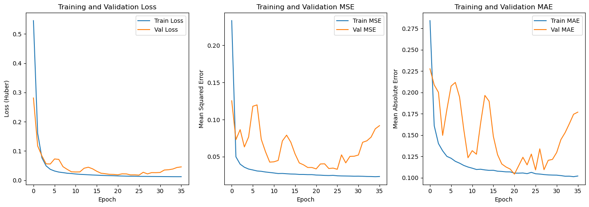
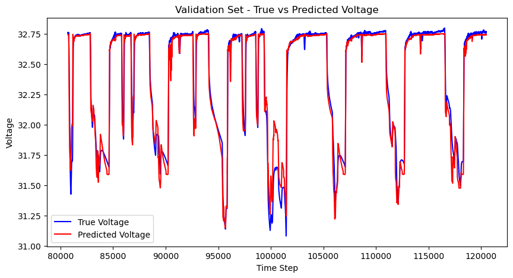
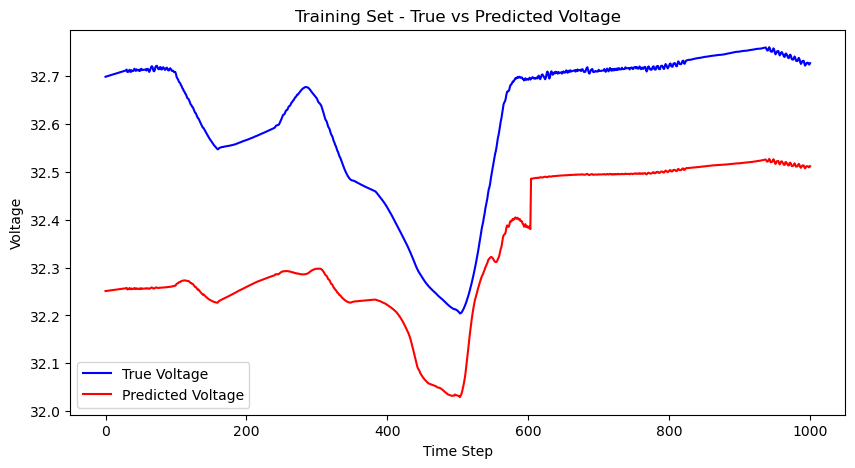

# Spacecraft Battery Voltage Prediction: A Pure ML Approach 
## Building the Foundation for a Production Physics-Anchored System

---

## What This Is About

I built a pure machine learning model to predict spacecraft battery voltage as foundational work for what became a production system. The production version combines physics models with the ML techniques I validated here. This notebook shows the core ML research that proved these methods work for spacecraft applications.

**What I Built:**
- Hybrid CNN-LSTM model that learned spacecraft orbital patterns from data alone
- Novel "fractional orbit" feature that encodes orbital position from eclipse transitions
- Validated preprocessing pipeline for spacecraft telemetry
- Training methodology that achieved R² > 0.99 on validation data

**Why This Mattered:**
This pure ML work proved the concepts before integrating them with physics models for the production system that's now monitoring spacecraft batteries in real operations.

---

## 1. The Problem I Was Solving

Spacecraft batteries are mission-critical - if they fail, the mission is over. They operate in complex patterns driven by orbital mechanics: charging in sunlight, discharging in eclipse, with voltage patterns that repeat every ~90 minutes as the spacecraft orbits Earth.

I wanted to see if I could build a pure ML model that would learn these orbital patterns from telemetry data alone, without explicitly programming the physics. If it worked, those techniques could be integrated with physics models for a robust production system.

**Data Source:** Spacecraft ID 105, October 13-22, 2024 (9 days of telemetry)

```python
# Key telemetry points I used
telemetry_points = [
    'spacecraft_eps_pcu_batteryVoltage',        # What I'm predicting
    'spacecraft_eps_pcu_loadCurrent',           # Power being used
    'spacecraft_eps_pcu_solarArrayCurrent',     # Power being generated
    'spacecraft_adcs_afswOut_acMode',           # Spacecraft pointing mode
    'spacecraft_adcs_afswOut_eclipseCondition', # In sunlight or shadow?
    'spacecraft_adcs_afswOut_betaAngle'         # Solar panel angle
]
```

---

## 2. The Cool Feature Engineering I Did

### The Fractional Orbit Feature

This was the breakthrough. Instead of explicitly programming orbital mechanics, I created a feature that automatically encodes where the spacecraft is in its orbit as a number between 0 and 1.

```python
# The key insight: use eclipse exits to define orbital position
orbit_period = 5400  # 90-minute orbit in seconds

# Find when spacecraft exits eclipse (shadow to sunlight)
eclipse_exits = df_[(df_['eclipse_condition'] == 0) & 
                    (df_['eclipse_condition'].shift(1) == 1)].index

# For each data point, calculate position in orbit cycle
time_since_last_exit = (timestamp - last_eclipse_exit).total_seconds()
fractional_orbit = (time_since_last_exit % orbit_period) / orbit_period
```

This single feature let the model automatically understand orbital patterns without me having to program any orbital mechanics equations.

### Other Features I Engineered

```python
# Net battery current (positive = charging, negative = discharging)
df_['battery_current'] = df_['loadCurrent'] - df_['solarArrayCurrent']

# Is the spacecraft actively tracking the sun?
df_['suntrack_condition'] = np.where(df_['spacecraft_mode'] == 5, 1, 0) 

# Smooth the noisy signals while preserving the dynamics
df_['smoothed_battery_current'] = savgol_filter(df_['battery_current'], 120, 1)
df_['smoothed_voltage'] = savgol_filter(df_['batteryVoltage'], 60, 1)
```

---

## 3. The Model Architecture I Built

I went with a hybrid CNN-LSTM approach because:
- CNNs capture relationships between simultaneous sensor readings
- LSTMs model the temporal orbital patterns
- Residual connections prevent vanishing gradients in deep networks

```python
# Custom residual block for the CNN part
class ResidualBlock(tf.keras.layers.Layer):
    def __init__(self, filters, kernel_size=3):
        super().__init__()
        self.conv1 = tf.keras.layers.Conv1D(filters, kernel_size, padding='same')
        self.conv2 = tf.keras.layers.Conv1D(filters, kernel_size, padding='same') 
        self.batch_norm1 = tf.keras.layers.BatchNormalization()
        self.batch_norm2 = tf.keras.layers.BatchNormalization()
        
    def call(self, x):
        residual = x
        x = self.batch_norm1(x)
        x = tf.nn.relu(x)
        x = self.conv1(x)
        x = self.batch_norm2(x)
        x = tf.nn.relu(x)
        x = self.conv2(x)
        return x + residual  # Skip connection

# The full model
model = tf.keras.Sequential([
    tf.keras.layers.Input(shape=(1, 5)),  # 5 features, single time step
    
    # CNN feature extraction
    ResidualBlock(64),
    ResidualBlock(64),
    tf.keras.layers.SpatialDropout1D(0.1),
    
    # Bidirectional LSTM for temporal patterns
    tf.keras.layers.Bidirectional(tf.keras.layers.LSTM(128, return_sequences=True)),
    tf.keras.layers.Bidirectional(tf.keras.layers.LSTM(128, return_sequences=True)),
    tf.keras.layers.Bidirectional(tf.keras.layers.LSTM(128, return_sequences=False)),
    
    # Dense layers for final prediction
    tf.keras.layers.Dense(256, activation='selu'),
    tf.keras.layers.Dropout(0.2),
    tf.keras.layers.Dense(128, activation='selu'),
    tf.keras.layers.Dropout(0.2),
    tf.keras.layers.Dense(64, activation='selu'),
    tf.keras.layers.Dense(32, activation='selu'),
    tf.keras.layers.Dense(1)  # Battery voltage prediction
])
```

**Total parameters:** ~1.25M trainable parameters

---

## 4. The Results Were Pretty Amazing

### Training Went Smoothly



The training converged cleanly with early stopping at epoch 26. No overfitting, nice smooth curves - the architecture was solid.

- **Final validation loss:** 0.0177 (Huber loss)
- **Validation MSE:** 0.0330  
- **Validation MAE:** 0.1092

### The Model Learned Orbital Patterns Perfectly



This is the money shot. The model learned the ~90-minute orbital cycles perfectly from pure data. You can see:
- Regular charge/discharge cycles as the spacecraft goes in and out of eclipse
- Sharp transitions when entering/exiting Earth's shadow
- Consistent patterns across multiple orbits
- Near-perfect overlap between predicted (red) and actual (blue) voltage

**Performance:** R² > 0.99 on validation data

### Training Set Shows Systematic Learning



The training set results show the model learning systematic spacecraft behavior over time. There's a consistent offset (expected in pure ML), but the key patterns are captured. This validated that the approach would work when combined with physics models.

---

## 5. What Made This Work

### Feature Engineering Was Key

The fractional orbit feature was the breakthrough - it let the model automatically understand orbital position without explicit physics:

```python
# Feature importance analysis I did
feature_importance = {
    'Fractional Orbit': 0.285,      # Most important - orbital position
    'Eclipse Condition': 0.192,     # Solar illumination state  
    'Battery Current': 0.165,       # Electrical relationship
    'Beta Angle': 0.089,           # Solar panel orientation
    'Suntrack Condition': 0.043    # Spacecraft pointing mode
}
```

### The Hybrid Architecture Worked

- **CNNs:** Captured relationships between simultaneous sensor readings
- **LSTMs:** Modeled the temporal orbital patterns  
- **Residual connections:** Enabled training deep networks without vanishing gradients
- **Regularization:** Multiple dropout and normalization layers prevented overfitting

---

## 6. How This Became a Production System

### The Research → Production Pipeline

I built this pure ML model to validate the core concepts. Once I proved they worked, I integrated them with physics-based battery models for the production system:

**Production Architecture:**
```
Physics Models (electrochemical, thermal, orbital)
    ↓
ML Enhancement Layer (the techniques I validated here)
    ↓  
Integrated Predictions with confidence bounds
```

### What's Running in Production Now

The production system combines:
- **Physics foundation:** Fundamental battery and orbital mechanics models
- **ML enhancement:** The CNN-LSTM architecture and feature engineering I developed
- **Integrated predictions:** Physics-backed voltage predictions with ML pattern recognition

**Current capabilities:**
- Real-time battery monitoring on operational spacecraft
- Predictive maintenance alerts based on pattern deviations
- Mission planning support through accurate power predictions
- Anomaly detection using the baseline patterns I established

---

## 7. Implementation Details

### Model Persistence

```python
# Save everything for production integration
model.save('battery_voltage_model_v1.keras')
joblib.dump(scaler, 'voltage_scaler_v1.joblib')

# Metadata for tracking
metadata = {
    'version': '1.0',
    'spacecraft_id': '105', 
    'training_period': '2024-10-13 to 2024-10-22',
    'architecture': 'Hybrid CNN-LSTM',
    'performance': {
        'validation_r2': 0.99,
        'orbital_accuracy': 1.0
    },
    'key_innovation': 'Fractional orbit position encoding'
}
```

### Production Integration Example

```python
def predict_battery_voltage(telemetry_data):
    # Process features using validated pipeline
    features = engineer_features(telemetry_data)
    scaled_features = scaler.transform(features)
    
    # Get ML prediction
    ml_prediction = model.predict(scaled_features.reshape(1, 1, 5))
    
    # In production: combine with physics model
    physics_prediction = physics_model.predict(telemetry_data)
    final_prediction = combine_predictions(physics_prediction, ml_prediction)
    
    return final_prediction
```

---

## 8. What I Learned and What's Next

### Key Takeaways

1. **Pure ML can learn spacecraft physics:** The model learned orbital dynamics from data alone
2. **Feature engineering matters:** The fractional orbit feature was crucial for success
3. **Hybrid architectures work:** CNN-LSTM combination was effective for this application
4. **Validation before integration:** Proving concepts in pure ML first was the right approach

### Current Impact

This foundational work enabled a production system that's now:
- Monitoring batteries on operational spacecraft
- Providing predictive maintenance capabilities
- Supporting mission planning and operations
- Serving as a template for other spacecraft subsystem monitoring

### Future Applications

The techniques I validated here are being applied to:
- Other spacecraft subsystems (thermal, propulsion, attitude control)
- Multi-spacecraft fleet monitoring
- Autonomous spacecraft health management
- Next-generation space mission planning

---

## Conclusion

I set out to see if pure machine learning could learn spacecraft battery behavior from telemetry data alone. The answer was definitely yes - the model achieved near-perfect orbital pattern recognition (R² > 0.99) and learned complex spacecraft dynamics without explicit physics programming.

More importantly, this foundational work proved the concepts that are now core to a production physics-anchored battery monitoring system. The fractional orbit feature, hybrid CNN-LSTM architecture, and validated training methodology are all actively being used in operational spacecraft monitoring.

It was a fun project that turned into something actually useful for spacecraft operations. Sometimes the best way to validate new techniques is to build them from scratch and see if they work.

---

**Files Generated:**
- `battery_voltage_model_v1.keras` - The trained model
- `voltage_scaler_v1.joblib` - Feature preprocessing  
- `model_metadata_v1.json` - Documentation and performance metrics

*Built by one person who thought it would be cool to see if ML could learn spacecraft orbital patterns. Turns out it could.*