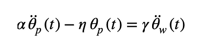
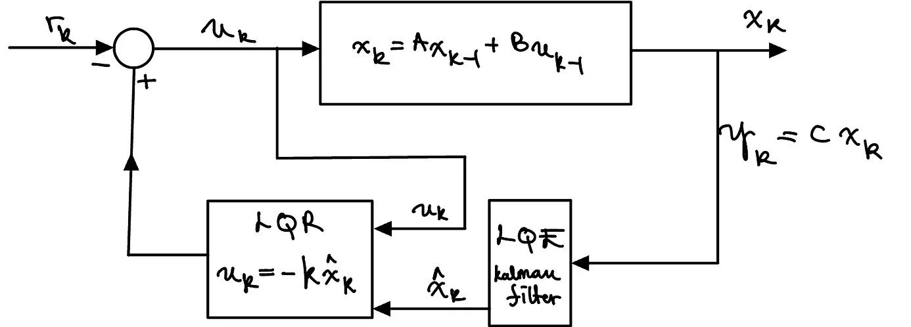
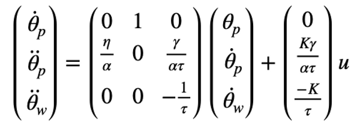
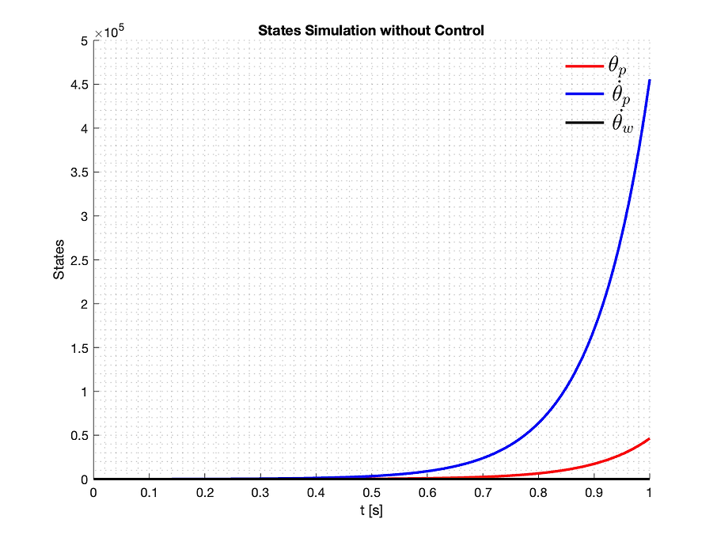
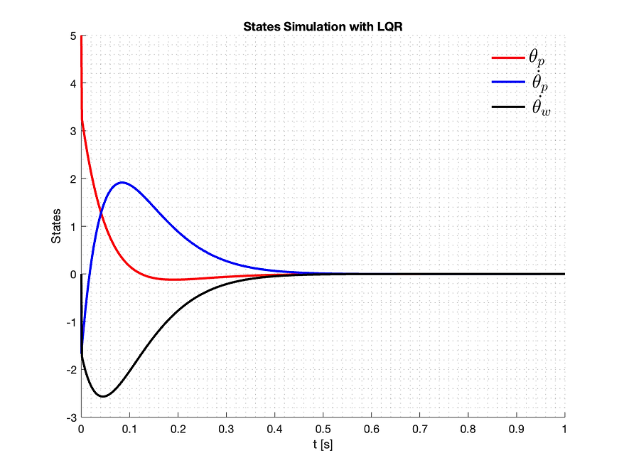
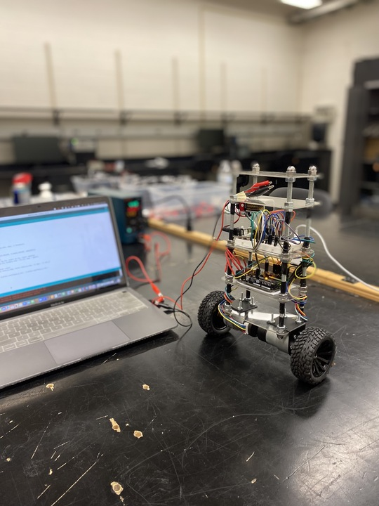
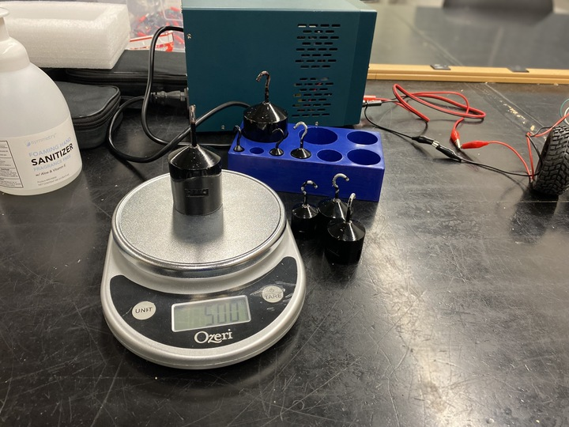

# Inverted Pendulum: Two-Wheeled Balancing Robot

## Overview

This project focuses on the design and implementation of a two-wheeled self-balancing robot, which functions like an inverted pendulum system. Such systems are inherently unstable and require active stabilization through feedback control. Using an Arduino Uno, an MPU-6050 IMU, and two brushed DC motors, the robot's nonlinear dynamics were stabilized using a state-feedback controller and a Linear Quadratic Regulator (LQR).

## Motivation

A two-wheeled balancing robot exemplifies modern control engineering concepts. It showcases how inherently unstable systems can be controlled using feedback mechanisms, state estimation, and advanced modeling techniques. This project demonstrates the practical application of these concepts in robotics.

## Dynamic Modeling

### System Modeling
The robot was modeled as a rigid rod fastened to a wheel. The dynamics of the system were derived by applying classical mechanics, separating the rod and the wheel, and deducing their state equations of motion.

#### Linearized Equation of Motion
After extensive derivations, the linearized equation of motion for the robot is given by:

Where:
- alpha, eta, gamma are constants determined by the robot's physical parameters.
- theta_p is the pitch or tilt angle.
- theta_w represents the angular displacement of the wheel.

#### Motor Dynamics
Using a first-order model for the DC motor, the angular velocity of the wheel (theta_w dot) was derived as:

Where:
- K is the motor's gain.
- tau is the motor's settling time.

### State-Space Representation
The system was described in state-space form, with the states being the pitch angle (theta_p), pitch rate (theta_p dot), and angular velocity of the wheel (theta_w dot):

This representation enables the design of state-feedback controllers such as the LQR.

## Control Strategy

### Linear Quadratic Regulator (LQR)
To stabilize the system, an LQR controller was implemented using a cost matrix Q. The controller minimizes a cost function that balances state errors and control effort.

### State Estimation with Kalman Filter
Accurate control requires precise state estimation. A Kalman filter was used to estimate the full state of the system, combining IMU data to predict future states and correct for measurement noise and inconsistencies.

## Hardware Components

1. **Microcontroller**: Arduino Uno.
2. **IMU**: MPU-6050, providing accelerometer and gyroscope data.
3. **DC Motors**: Two GM37-520ABHL brushed DC motors with encoders and 30:1 reduction gearboxes.
4. **Motor Driver**: TB6612FNG, capable of supplying 1.2 A per channel.

### Hardware Implementation
- The MPU-6050 IMU measured the tilt angle using a combination of accelerometer and gyroscope data.
- The Arduino processed the IMU data and used the LQR controller to generate control signals for the motors.
- The motors' speed and direction were adjusted based on feedback from the Kalman filter's state estimates.

## Simulation and Results

### Open-Loop Simulation
An initial open-loop simulation of the system revealed instability, with states diverging to infinity, indicating the need for active control:

### Closed-Loop Simulation with LQR
With the LQR controller, the system was stabilized, with all states converging to zero within approximately 0.35 seconds:

## Demo Videos

### Demo 1: Initial Balancing with LQR Controller
  
*Click on the image to watch the video.*

### Demo 2: Robustness Testing
  
*Click on the image to watch the video.*

## Conclusion

The project successfully demonstrated the stabilization of a two-wheeled balancing robot using an LQR controller and Kalman filtering. The approach effectively controlled the inherently unstable dynamics, highlighting the power of modern control techniques in robotics.

---
