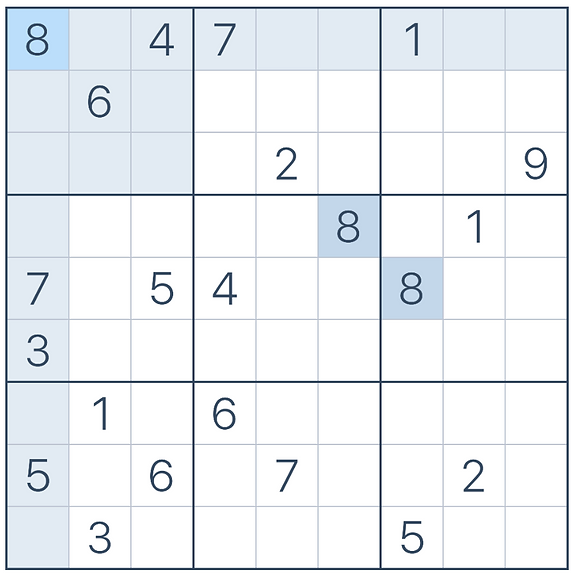
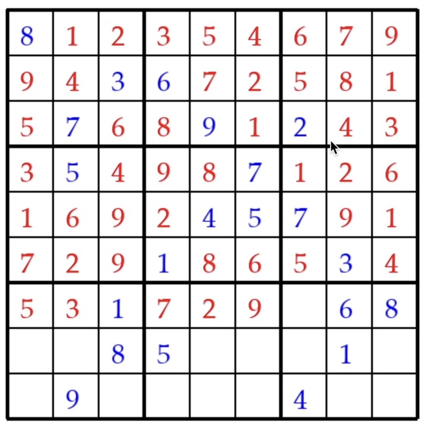
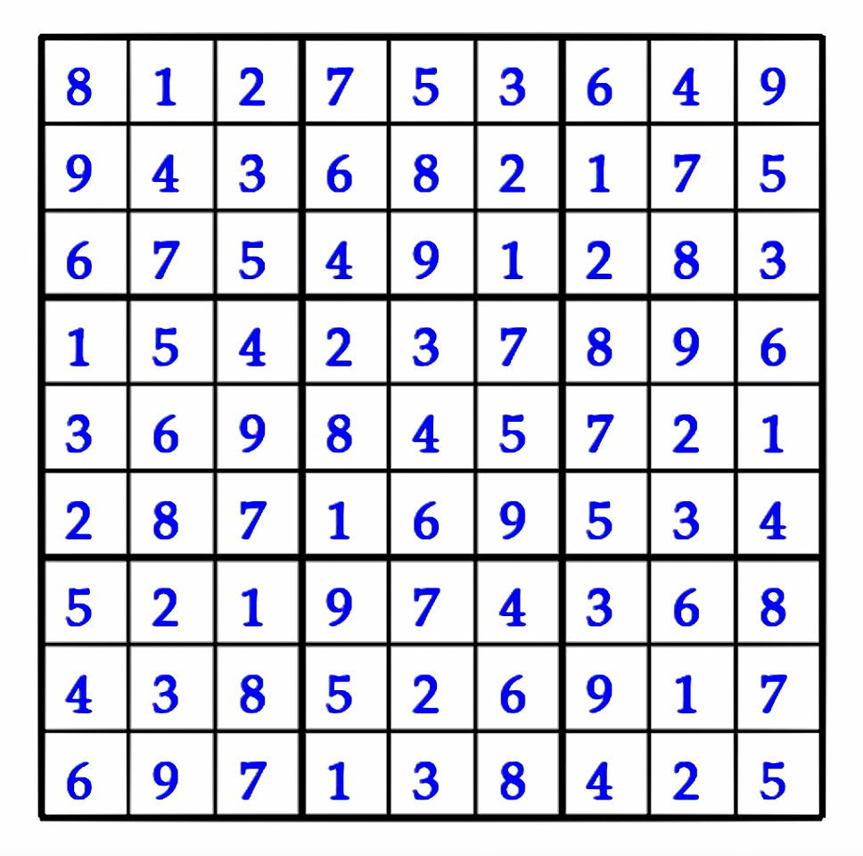

# Sudoku Solver with Backtracking Visualization

## Overview

This project implements a Sudoku solver using the backtracking algorithm, enhanced with a graphical visualization of the solving process using Python's `pygame` library. The objective of the solver is to fill a partially completed Sudoku board so that each row, column, and 3x3 grid contains all digits from 1 to 9, without repetition.

## Motivation

Solving Sudoku puzzles demonstrates the power of backtracking algorithms, where solutions are built incrementally and abandoned as soon as they are deemed invalid. While backtracking isn't always the most efficient approach, it offers a significant improvement over brute-force solutions, which check all possible arrangements. This project visualizes the solving process, making it a fun and educational experience.

## Method

1. **Board Initialization**:
   - The Sudoku board is represented as a 9x9 grid using a two-dimensional list. Empty cells are denoted by zeroes.
2. **Finding Empty Squares**:
   - A helper function `find_empty_sqr` locates empty cells within the grid.
3. **Value Validation**:
   - The `validate_our_value` function checks if a number can be placed in a specific cell, adhering to Sudoku rules.
4. **Backtracking Algorithm**:
   - The `sudoku_solver` function uses backtracking to fill the board recursively, visualizing each step using `pygame`.

## Visualization

The process is visualized using `pygame`, where each number placement and backtracking step is displayed on a graphical Sudoku board.

## How to Run

1. Install `pygame` if you haven't already: `pip install pygame`
2. Run the script: `python sudoku_solver.py`

A window will open, displaying the Sudoku solving process.

## Example Board

The following board represents the "hardest Sudoku puzzle in the world," used as input for the solver:

## Timeseries Video

### Visualization of Backtracking Algorithm in Action

*Click on the image to watch the video.*

## Final Solved Board

Here is the solved state of the board after running the solver:

## Code Overview

- `find_empty_sqr(board)`: Locates empty cells.
- `validate_our_value(board, value, coordinates)`: Checks if a value is valid for a given cell.
- `sudoku_solver(window)`: Solves the board using backtracking and visualizes the process.
- `draw_window()`: Draws the Sudoku grid and populates it with initial values.
- `main()`: Initializes the `pygame` window and starts the solver.
