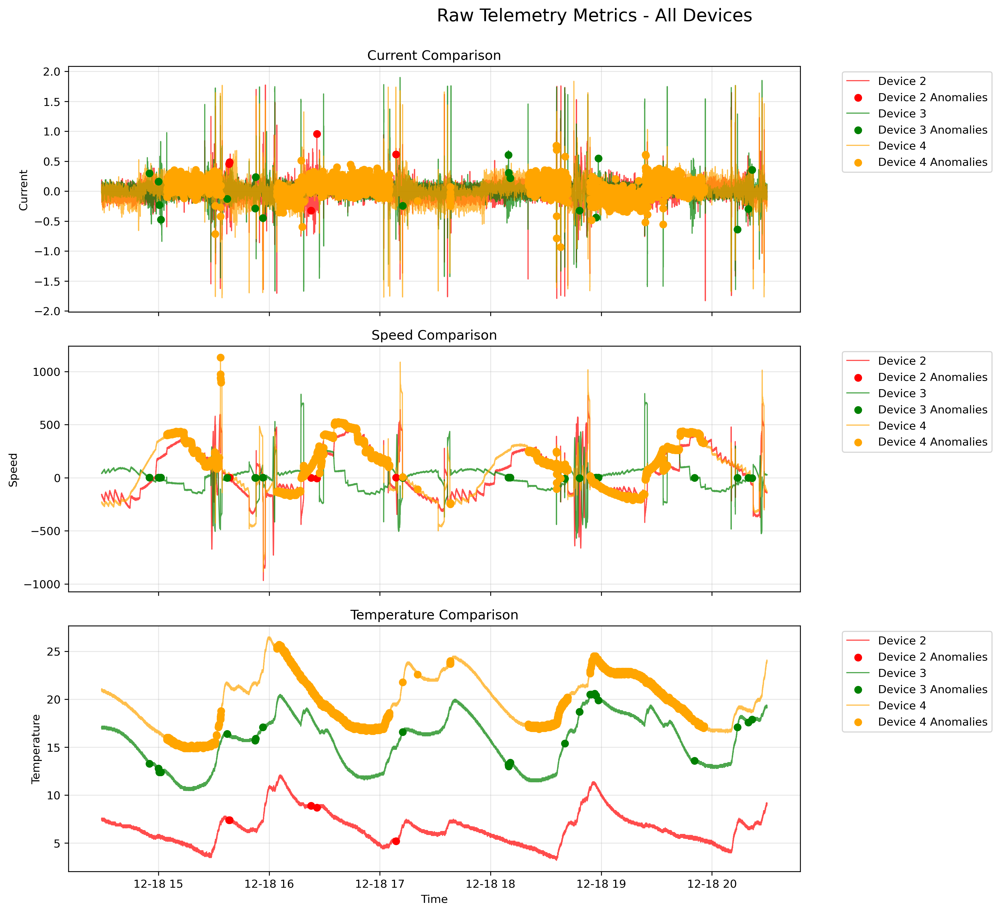

# Reaction Wheel Friction Detection CLI Tool

A command-line tool for detecting spacecraft reaction wheel anomalies using Isolation Forests, PCA, and engineered features from on-orbit telemetry data.

## What It Does

This tool analyzes spacecraft telemetry to detect friction anomalies in reaction wheels through a comprehensive pipeline that includes:

- **Custom Feature Engineering**: Extracts specialized features including normalized current, residual speed error, and deformed current baselines
- **Advanced Data Processing**: Applies Savitzky-Golay filtering, standardization, and feature bounds validation
- **Fault Simulation**: Implements sophisticated anomaly injection for model training using mode-based baselines
- **Machine Learning Pipeline**: Trains Isolation Forest models with optional PCA dimensionality reduction
- **Comprehensive Visualization**: Generates detailed plots for analysis, comparison, and operational insight

## Important Note

This tool was developed to run in a production spacecraft operations environment with access to internal telemetry pipelines (Elasticsearch-backed queries). **It is not runnable outside of that environment**, but the source code demonstrates the complete end-to-end design and feature engineering pipeline used in live operations.

## Why It's Open Source

I've shared this code to demonstrate how I designed a full telemetry-to-detection pipeline for spacecraft health monitoring. While the telemetry access layer is environment-specific, the pipeline architecture, feature engineering approaches, and anomaly detection methodology may be valuable for similar projects in:

- Spacecraft health monitoring systems
- Industrial equipment anomaly detection
- Time series anomaly detection with engineered features
- Multi-device comparative analysis

## Architecture Overview

```
Raw Telemetry → Feature Engineering → Data Processing → Model Training/Prediction → Visualization
     ↓                    ↓                 ↓                    ↓                  ↓
- Current/Speed      - Normalized      - Filtering        - Isolation        - Time Series
- Temperature        - Residual        - Standardization    Forest           - Anomaly Plots  
- AC Mode           - Deformed        - PCA (optional)   - Contamination    - Comparison
- Target Values     - Baseline        - Bounds Check     - Cross-validation - Raw Metrics
```

## Key Features

### Advanced Feature Engineering
- **Mode-Based Baselines**: Computes reaction wheel current baselines using spacecraft attitude control modes
- **Deformation Simulation**: Creates realistic anomaly patterns for training data augmentation
- **Normalized Current**: Speed-compensated current analysis to isolate friction effects
- **Residual Speed Error**: Target vs actual speed discrepancy detection

### Robust Data Processing
- **Savitzky-Golay Filtering**: Configurable smoothing for noise reduction
- **Feature Bounds**: Automatic computation and application of statistical bounds
- **Multi-Device Support**: Simultaneous analysis of up to 4 reaction wheels
- **Blacklist Filtering**: Selective feature exclusion for targeted analysis

### Machine Learning Pipeline
- **Isolation Forest**: Unsupervised anomaly detection optimized for spacecraft telemetry
- **Advanced PCA Integration**: Multi-component dimensionality reduction with feature-type separation
- **Cross-Validation Framework**: Test/validation split with robust generalization assessment
- **Model Persistence**: Serialized models with PCA transformations for operational deployment
- **Component Analysis**: Principal component visualization for interpretable anomaly characterization

## Sample Results

### Multi-Device Comparative Analysis


*Additional analysis plots and visualizations are generated in the `rw_anomaly_detection/plots/` directory.*

## Usage Examples

### Training Mode
```bash
# Train models for all devices with custom parameters
python rw_friction_detection.py --train --devices all --contamination 0.01 --deform-factor 0.5

# Train specific devices with feature blacklisting
python rw_friction_detection.py --train --devices 1,3 --blacklist Temperature --contamination 0.005

# Train with PCA disabled and noise injection
python rw_friction_detection.py --train --devices 2,4 --skip-pca --use-noise --noise-factor 0.3
```

### Prediction Mode
```bash
# Run predictions on all trained devices
python rw_friction_detection.py --predict --devices all

# Predict with filtered standardized features
python rw_friction_detection.py --predict --devices 1,2 --filter-standardized
```

## Project Structure

```
rw_anomaly_detection/
├── models/                     # Trained models and parameters
│   ├── device_1_model.pkl     # Serialized Isolation Forest model
│   ├── device_1_feature_bounds.json  # Feature boundary parameters
│   └── scale_factors.json     # Baseline scaling factors
├── plots/                     # Generated visualizations
│   ├── device1_anomalies.png  # Individual device analysis
│   ├── devices_comparison.png # Multi-device comparison
│   └── raw_metrics_comparison.html  # Interactive plots
└── rw_friction_detection.py   # Main CLI tool
```

## Configuration

### Device Features
```python
DEVICE_FEATURES = {
    1: {
        "DeformedCurrent": "deformed_current_rw1",
        "NormalizedCurrent": "normalized_current_rw1", 
        "ResidualSpeed": "residual_speed_error_rw1",
        "Temperature": "spacecraft_adcs_measHealth_rwTemps_1"
    }
    # ... additional devices
}
```

### Feature Thresholds
```python
DEFAULT_FEATURE_THRESHOLDS = {
    "Temperature": 4,
    "DeformedCurrent": 8,
    "NormalizedCurrent": 30,
    "ResidualSpeed": 11
}
```

## Technical Details

### Baseline Computation
The tool uses a sophisticated mode-based baseline computation that:
- Tracks spacecraft attitude control mode transitions
- Smooths brief mode changes to avoid baseline instability
- Computes segment-wise current baselines for anomaly injection

### Anomaly Simulation
Deformation injection includes:
- **Sinusoidal shifts** based on temporal patterns
- **Random spikes** proportional to baseline magnitude
- **Step changes** with mode-dependent scaling
- **Noise injection** as an alternative to deterministic deformation

### Feature Bounds Application
Statistical bounds are computed during training and applied during prediction to:
- Zero out features within normal operational bounds
- Apply complex time-varying transformations to exceedances
- Maintain signal characteristics while filtering routine variations

## Performance Characteristics

- **Processing Speed**: Handles 6+ hours of 1Hz telemetry data in minutes
- **Memory Usage**: Optimized for streaming telemetry processing
- **Accuracy**: Tuned contamination parameters for spacecraft operational profiles
- **Scalability**: Concurrent processing of multiple reaction wheel units

## Dependencies

Key libraries used in the pipeline:
- `scikit-learn`: Machine learning algorithms and preprocessing
- `pandas/numpy`: Data manipulation and numerical computing
- `scipy`: Signal processing (Savitzky-Golay filtering)
- `matplotlib/seaborn`: Static visualizations
- `plotly`: Interactive telemetry plots
- `elasticsearch`: Telemetry data access (production environment)

## Command Line Arguments

| Argument | Description | Default |
|----------|-------------|---------|
| `--train` | Train anomaly detection models | - |
| `--predict` | Run anomaly prediction | - |
| `--devices` | Device selection (comma-separated or 'all') | `all` |
| `--contamination` | Isolation Forest contamination parameter | `0.01` |
| `--blacklist` | Feature types to exclude | - |
| `--deform-factor` | Anomaly simulation strength | `0.5` |
| `--skip-pca` | Disable PCA dimensionality reduction | `False` |
| `--filter-standardized` | Apply filtering after standardization | `False` |

## Key Capabilities

- **Multi-Device Monitoring**: Simultaneous analysis across reaction wheel arrays
- **Feature Engineering**: Custom telemetry transformations for anomaly detection  
- **Model Validation**: Cross-dataset testing for deployment confidence
- **Visualization Suite**: Comprehensive plots for analysis and monitoring

## Use Cases

This pipeline architecture is applicable to:

1. **Spacecraft Operations**: Reaction wheel health monitoring and predictive maintenance
2. **Industrial IoT**: Rotating machinery anomaly detection
3. **Fleet Management**: Comparative analysis across similar devices
4. **Research**: Time series anomaly detection methodology development

## Key Innovations

- **Multi-Device Correlation**: Simultaneous analysis across reaction wheel arrays with cross-device anomaly correlation
- **Mode-Aware Processing**: Leverages spacecraft operational modes for intelligent baseline computation
- **Multi-Scale Feature Engineering**: Combines raw telemetry with derived physical insights (normalized current, residual speed)
- **Fault Injection Framework**: Realistic anomaly simulation using spacecraft dynamics for robust model training
- **Production-Ready Visualization**: Interactive dashboards designed for mission operations centers
- **Thermal-Mechanical Integration**: Correlates temperature dynamics with mechanical anomalies for comprehensive health assessment

---

*This tool represents a production-ready approach to spacecraft health monitoring, combining domain expertise in spacecraft systems with modern machine learning techniques for reliable anomaly detection in mission-critical applications.*